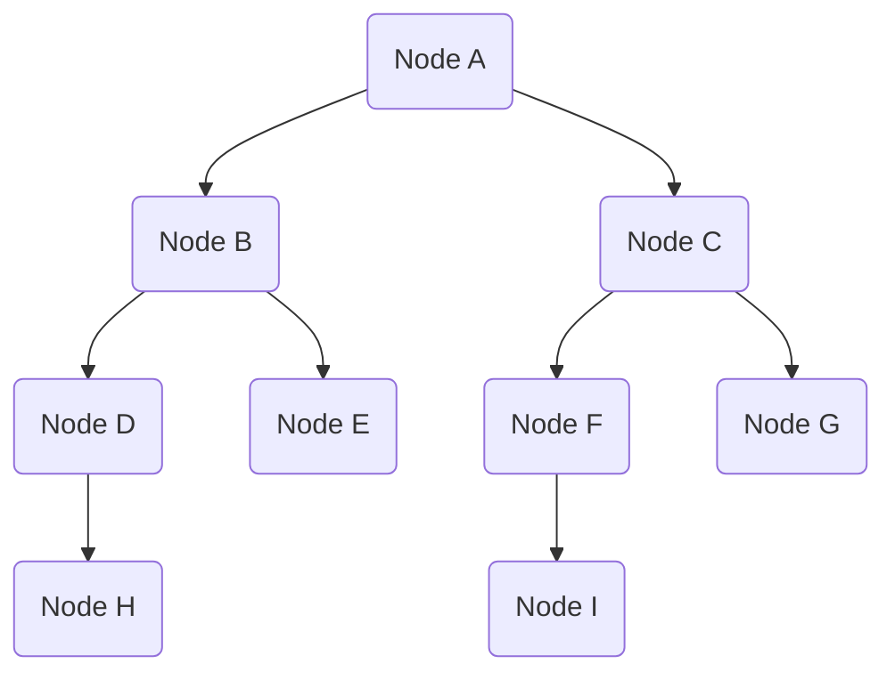

# gossip-protocol
It is an implementation of blockchain gossip protocol. 

A Gossip Protocol is often used in distributed systems for spreading information among nodes. The key idea is that each node randomly selects a few other nodes to share the information with, and those nodes, in turn, share it with others, continuing the process until the information is propagated throughout the network.

